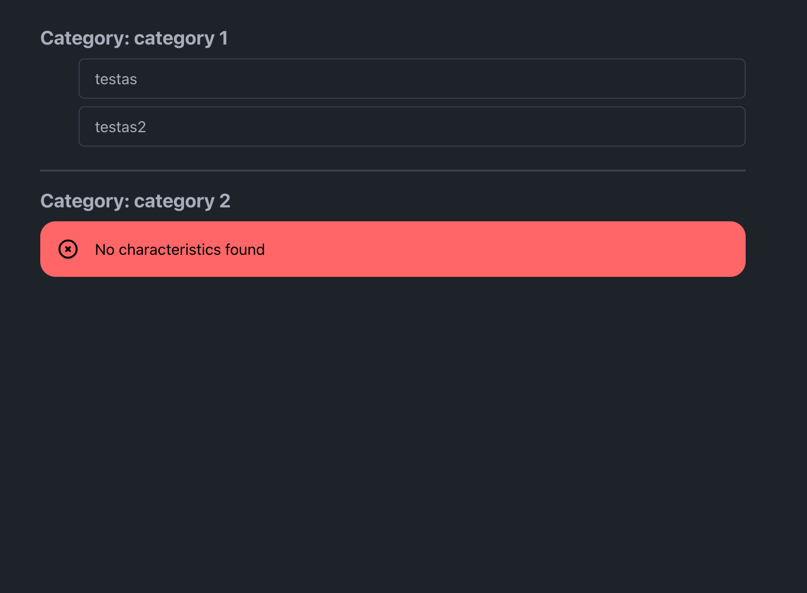

## About project

App allows to add, edit, delete characteristic categories and characteristics, attach characteristics to the categories and view them.

## Installation

1. Clone the repository
2. Run `composer install` or `./vendor/bin/sail composer install`
3. Run `./vendor/bin/sail up`
4. Run `./vendor/bin/sail yarn install && ./vendor/bin/sail yarn dev`
5. Run `./vendor/bin/sail artisan migrate`

# Admin panel

Visit admin panel `/admin`

# Create user

`php artisan make:filament-user` or `./vendor/bin/sail artisan make:filament-user`
